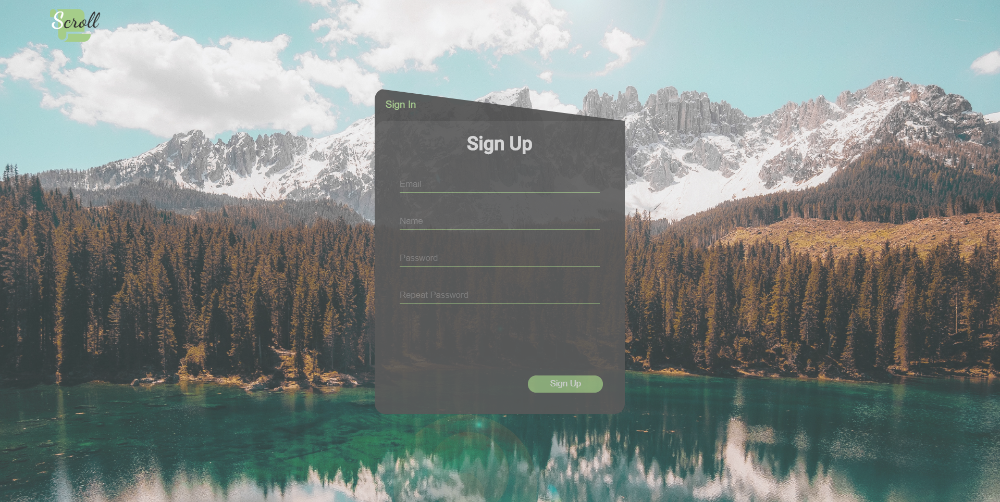
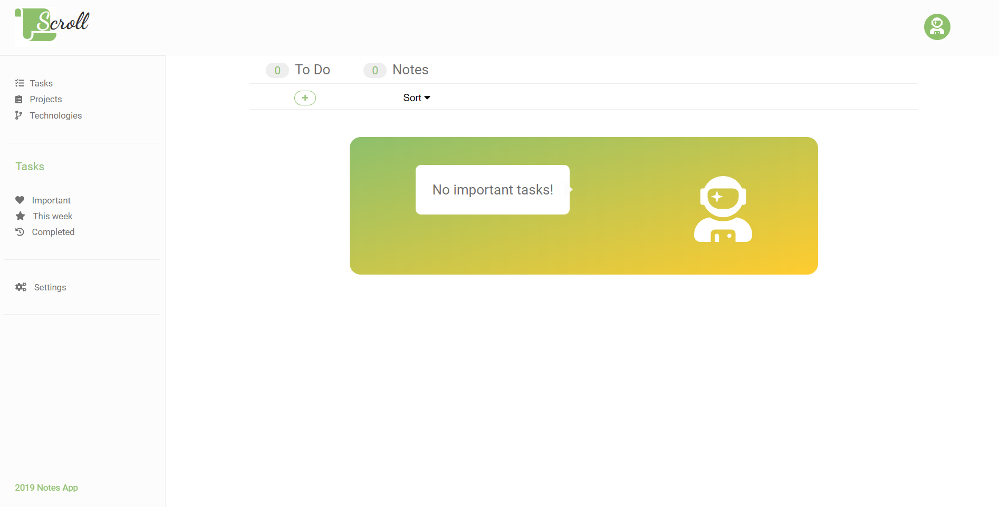
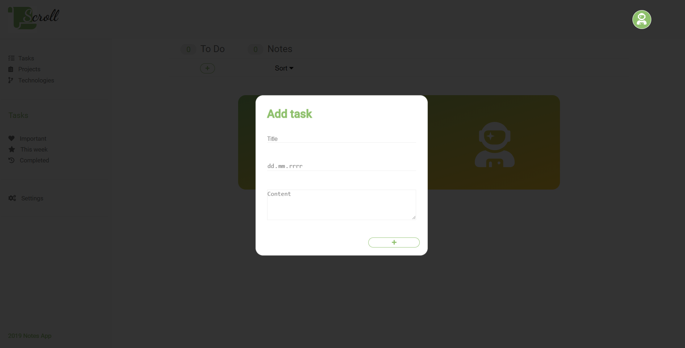
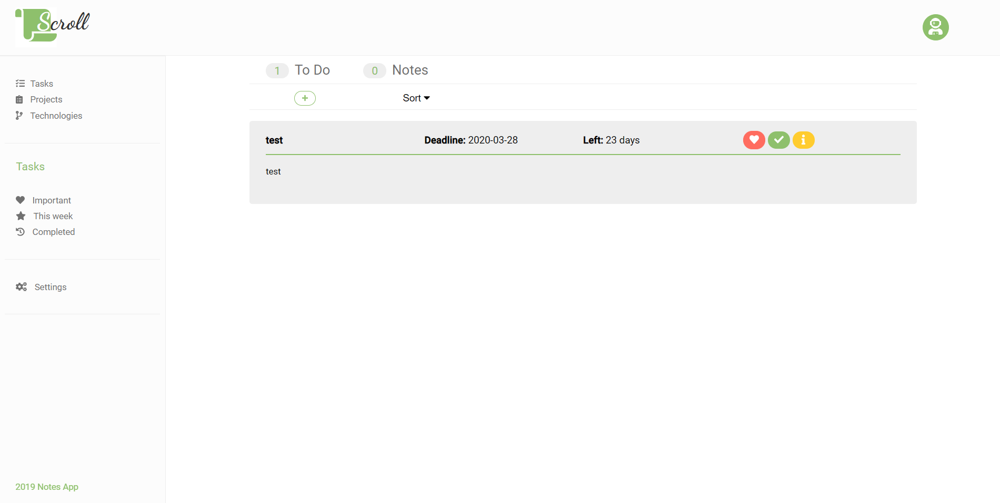
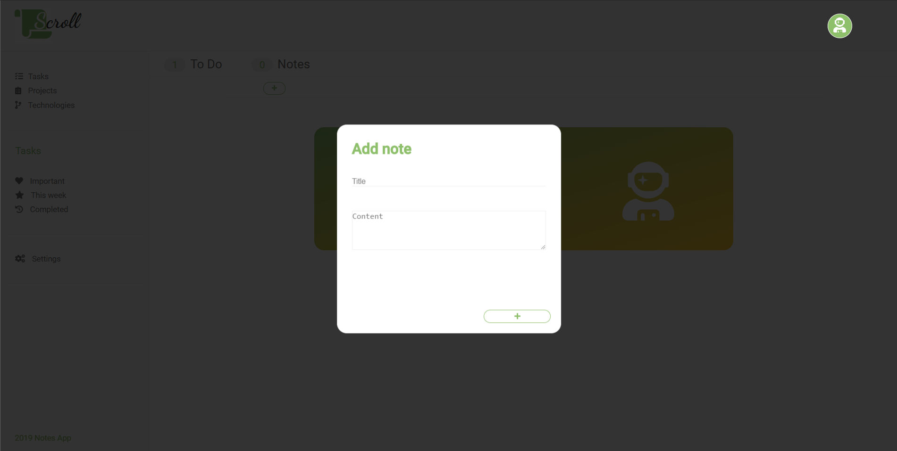
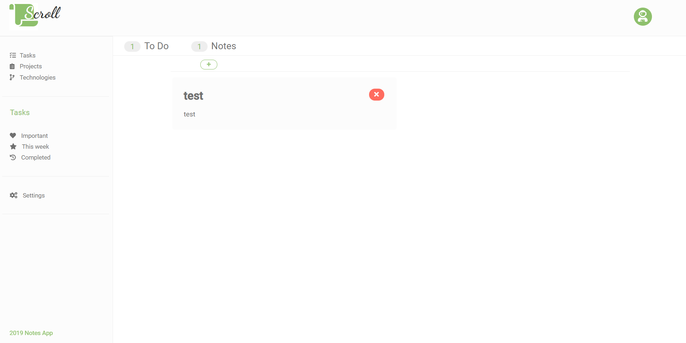

<p align="center">
 
</p>
<h1 align="center">
  Scroll
</h1>


***"Scroll App"*** is a React app rest api written in express.js.

This application isn't finished yet. It has one of 3 core features - managing tasks and notes.
We can create our own account in this app and add our tasks and notes. 
After adding new task we can change its status to: important or finished. After 
changing status our task is seen in appropriate tab (favourites task or finished tasks).
When we are creating new task we specify the deadline of this task and if we won't 
finish this task before deadline style of this task will change.

We can also create and delete notes in separate tab.


This app works with express rest api [Scroll backend](https://github.com/pawelpiatekProjects/ScrollBackend)
which has to be running.
***

###Demo screenshots















***
###Technologies
1. ReactJS
1. Rest Api
***

###Opening project


1.  **Start developing.**

    Navigate into your new site’s directory and start it up.

    ```shell
    cd reminder-v2
    npm start
    ```


    
  ***

###Project structure

A quick look at the top-level files and directories you'll see in a Gatsby project.

    .
    ├── node_modules
    ├── public
    ├── src
        ├── assets
        ├── components
        ├── containers
        ├── utils
        ├── App.js
        ├── index.css
        ├── index.js
        ├── serviceWorker.js
    ├── package.json
    ├── package-lock.json
    ├── README.md
    └── .gitignore

  **`/assets`**: This directory contains images and font awesome
  
  **`/components`**: This directory contains stateless components
  
  **`/containers`**: This directory contains statefull components
  
  **`/utils`**: This directory contains reusable components
  
  
 
    
